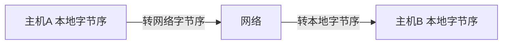

# 一、编程基础

## 1. 网络开发模型

B/S模型（browser / server）：浏览器与服务器模型。对服务器要求高，计算均在服务端进行，但移植性好，不依赖具体平台

C/S模型（client / server ）：客户端与服务器模型

## 2. TCP/IP协议栈


TCP和UDP属于传输层协议，IP为网络层协议

**TCP，传输控制协议**

特点：

- 面向连接，类似于打电话的过程，双方需要先建立连接，然后才能进行通信

- 具有超时重传、拥塞控制等机制，可以保证数据的可靠传输

  

**UDP 用户数据报协议**

特点：

- 面向无连接，类似于写信的过程，双方不需要先建立连接

- 不可靠，不保证数据一定能到达对端，需要在应用层增加可靠性机制

  

## 3. 大小端

大小端指的是数据在内存中存放的一种方式

- 大端：低位存高地址，高位存低地址（低高高低）

- 小端：低位存低地址，高位存高地址（低低高高）

```
下面用 unsigned int num = 0x01020304 为例，进行说明

     低地址 --> 高地址
大端  01  02  03  04 
小端  04  03  02  01  
```

不同架构的电脑，存储方式可能不同。一般个人电脑都是小端存储，服务器都是大端存储

按照规定，网络上传输数据，**统一使用大端**，网络上传输的字节序称为**网络字节序**，本地存储的字节序称为**本地字节序**。

发送时，需要将本地字节序转换为网络字节序；接收时，需要将网络字节序转换为本地字节序



## 4. 字节序转换

数据在网络上传输时，只要超过1个字节，就需要做字节序转换。1个字节的数据无需转换，因为1个字节没有大小端的问题

```c
#include <arpa/inet.h>

uint32_t htonl(uint32_t hostlong);
 # 将32位的主机字节序转换为网络字节序，一般用于Ip地址的字节序转换

uint16_t htons(uint16_t hostshort);
# 将16位的主机字节序转换为网络字节序，一般用于端口的字节序转换

uint32_t ntohl(uint32_t netlong);
# 将32位的网络字节序转换位主机字节序

uint16_t ntohs(uint16_t netshort);
# 将16位的网络字节序转换位主机字节序
```


## 5. 地址转换函数

```c
#include <arpa/inet.h>

int inet_pton(int af, const char *src, void *dst);
```

- 功能：将 ipv4地址的字符串形式，转换为32位的整数，转换后的整数为大端存储，即网络序；或者将ipv6地址的字符串形式，转换为128位的整数
- 参数：
  - af：协议族，ipv4 为 AF_INET，ipv6 为 AF_INET6
  - src：需要转换的字符串的首地址
  - dst：32位或128位的整数地址

- 返回值：成功返回1；如果要转换的字符串不是一个有效的ipv4/ipv6地址，返回0；如果af 协议族不是一个有效值，返回-1


```c
#include <arpa/inet.h>

const char *inet_ntop(int af, const void *src, char *dst, socklen_t size);
```

- 功能：将网络序的ip地址整数形式，转换为字符串形式

- 参数：

- 返回值：成功返回指向dst 的非空指针，失败返回NULL

  

## 6. socket

socket为了解决不同主机上的进程间通信

socket必须成对出现


## 7. 地址结构体

**通用套接字结构体**

```
struct sockaddr 
{
	sa_family_t  sa_family;
    char         sa_data[14];
}
```


**ipv4 套接字结构体**

```
struct sockaddr_in 
{
	sa_family_t     sin_family; /* address family: AF_INET */
	in_port_t       sin_port;   /* port in network byte order */
	struct in_addr  sin_addr;   /* internet address */
};

/* Internet address. */
struct in_addr 
{
	uint32_t       s_addr;     /* address in network byte order */
};
```


**ipv6套接字结构体**

```
https://blog.csdn.net/euyy1029/article/details/107708365utm_medium=distribute.pc_releant.none-task-blog-baidulandingword-1&spm=1001.2101.3001.4242 
```


# 二、UDP编程基础

## 1. C/S架构模型


- 服务器必须绑定固定的 IP 和端口，否则客户端不知道该往哪儿发

- 客户端无需绑定本地IP和端口，需要指定服务端IP和端口，客户端发送时，本地端口由系统随机分配

  

## 2. 函数说明

### 2.1 socket()

```
#include <sys/socket.h>

int socket(int domain, int type, int protocol);
```

- 功能：创建一个socket
- 参数：
  - domain：指定通信域，用于选择通信的协议族
    - AF_INET：用于ipv4通信
    - AF_INET6：用于ipv6通信
    - AF_UNIX，AF_LOCAL：用于本地通信
  - type：指定通信语义（指定创建 TCP / UDP / RAW socket)
    - SOCK_STREAM：流式套接字，用于TCP，提供面向连接、可靠、有序、全双工的比特流
    - SOCK_DGRAM：数据报套接字，用于UDP，无连接、不可靠
    - SOCK_RAW：原始套接字
  - protocol：指定socket使用的协议，通常为0
- 返回值：成功返回文件描述符；失败返回-1，并设置errno

**注意**：创建socket的时候，系统会为该socket分配两块缓冲区，一个用于读，一个用于写


### 2.2 bind()

```
#include <sys/socket.h>

int bind(int sockfd, const struct sockaddr *addr, socklen_t addrlen);
```

- 功能：给socket 绑定IP和端口
- 参数：
  - sockfd：绑定的socket
  - addr：绑定的IP和端口。IP和端口为网络序，并需要将ipv4 / ipv6 套接字结构体转成通用套接字结构体
  - addrlen：ipv4 / ipv6 地址长度（字节数）
- 返回值：成功返回0；失败返回-1，并设置errno


### 2.3 sendto()

```
#include <sys/types.h>
#include <sys/socket.h>

ssize_t sendto(int sockfd, const void *buf, size_t len, int flags,
               const struct sockaddr *dest_addr, socklen_t addrlen);
```

- 功能：通过socket 发送数据

- 参数：

  - sockfd：发送数据的 socket
  - buf：指向要发送数据的buf首地址
  - len：要发送的数据长度
  - flags：一般为0，可使用以下参数，具体用法参考man手册
    - MSG_CONFIRM
    - MSG_DONTROUTE
    - MSG_DONTWAIT
    - MSG_EOR
    - MSG_MORE
    - MSG_NOSIGNAL
    - MSG_OOB
  - dest_addr：目的地址
  - addrlen：目的地址长度

- 返回值：成功返回发送的字节数，失败返回-1，并设置errno

  

### 2.4 recvfrom()

```
#include <sys/types.h>
#include <sys/socket.h>

ssize_t recvfrom(int sockfd, void *buf, size_t len, int flags,
                 struct sockaddr *src_addr, socklen_t *addrlen);
```

- 功能：从socket 接收数据。如果接收的数据过长，Buf 不够，数据可能会被丢弃；如果没有消息可以接收，recvfrom会阻塞，除非该socket设置的非阻塞，那么此时会返回-1，并设置errno为EAGAIN 或 EWOULDBLOCK

- 参数：
  - sockfd：接收数据的sokcet
  - buf：存放数据的buf首地址
  - len：接收buf长度
  - flags：一般为0，可使用以下参数，具体用法参考man手册
    - MSG_CMSG_CLOEXEC
    - MSG_DONTWAIT
    - MSG_ERRQUEUE
    - MSG_OOB
    - MSG_PEEK
    - MSG_TRUNC
    - MSG_WAITALL
  - src_addr：如果底层协议提供消息的源地址，那么该源地址会被填入该缓冲区；如果不关心源地址，可以置为NULL
  - addrlen：该参数初始值需要设置为src_addr的长度，返回值为源地址实际长度。如果不关心源地址，可以置为NULL

- 返回值：成功返回接收到的字节数，失败返回 -1，并设置errno。如果为流式套接字，对端关闭时返回0；如果要接收的字节数为0，同样也会返回0


## 3. UDP协议格式


# 三、TCP编程基础

## 1. C/S架构模型

**注意**：下图中的connect到accept这条线画的不对，connect箭头应该指向listen下面


## 2. TCP服务器处理流程


- 监听套接字：只负责和客户端建立连接，不进行数据通信
- 已连接套接字：和客户端进行数据通信


## 3. 函数说明

### 3.1 connect()

```c
#include <sys/socket.h>

int connect(int sockfd, const struct sockaddr *addr, socklen_t addrlen);
```

- 功能：连接指定地址的服务器（通常，面向连接的socket只能使用一次，面向无连接的socket可以连接多次）
- 参数：
  - sockfd：创建的socket
  - addr：要连接的服务器地址
  - addrlen：服务器地址长度
- 返回值：成功返回0，失败返回-1，并设置errno


### 3.2 send()

```c
#include <sys/types.h>
#include <sys/socket.h>

ssize_t send(int sockfd, const void *buf, size_t len, int flags);
```

- 功能：发送数据到已连接的对端socket
- 参数
  - sockfd：已连接的socket
  - buf：要发送的数据Buffer
  - len：要发送的数据长度
  - flags：一般为0，可使用以下参数，具体用法参考man手册
    - MSG_CONFIRM
    - MSG_DONTROUTE
    - MSG_DONTWAIT
    - MSG_EOR
    - MSG_MORE
    - MSG_NOSIGNAL
    - MSG_OOB
- 返回值：成功返回已发送的字节数，失败返回-1，并设置errno


### 3.3 recv()

```
#include <sys/types.h>
#include <sys/socket.h>

ssize_t recv(int sockfd, void *buf, size_t len, int flags);
```

- 功能：从已连接的socket中接收数据，默认阻塞，除非socket设置为非阻塞
- 参数 
  - sockfd：已连接的socket
  - buf：接收数据的地址
  - len：接收Buff的长度
  - flags：一般为0，可使用以下参数，具体用法参考man手册
    - MSG_CMSG_CLOEXEC
    - MSG_DONTWAIT
    - MSG_ERRQUEUE
    - MSG_OOB
    - MSG_PEEK
    - MSG_TRUNC
    - MSG_WAITALL
- 返回值：成功返回接收的字节数，失败返回-1，并设置errno。如果socket设置为非阻塞，没有收到消息，recv会返回-1，并设置errno为 EAGAIN or EWOULDBLOCK；如果对端关闭，会返回0

```
recv() 等价于 recvfrom(fd, buf, len, flags, NULL, 0);
```


### 3.4 listen()

​		**监听的时候，套接字会由主动变成被动，同时会创建两个队列，一个是已完成连接队列，一个是未完成连接队列。当客户端connect连接过来，先加入到未完成连接队列，当三次握手完成后，会加入到已完成连接队列。**

```c
#include <sys/types.h>          
#include <sys/socket.h>

int listen(int sockfd, int backlog);
```

- 功能：将套接字由主动变为被动，并创建两个连接队列（已完成连接队列和未完成连接队列）
- 参数：
  - sockfd：
  - backlog：两个队列长度总和的最大值，现在一般为128
- 返回值：成功返回0，失败返回-1，并设置error


### 3.5 accept()

```c
#include <sys/types.h>    
#include <sys/socket.h>

int accept(int sockfd, struct sockaddr *addr, socklen_t *addrlen);
```

- 功能：从已完成连接队列中，提取新的连接。同时创建一个已连接套接字，和当前这个客户端进行通信。默认是阻塞的
- 参数：

  - sockfd：监听套接字
  - addr：保存客户端地址的结构体
  - addrlen：结构体长度
- 返回值：成功返回已连接套接字，失败返回-1


# 四、TCP协议

## 1. TCP简介

​		**TCP提供一种面向连接的、可靠的、字节流的服务**。通信双方需要先建立连接，才能交换数据。TCP仅适用于双方通信，多播和广播不能用于TCP。

​		TCP通过下列方式提供可靠性。

- 数据被切割成TCP认为最合适发送的数据段
- 当发送一个TCP报文段后，发送端会启动一个定时器，等待对端确认接收到该报文段。如果没有及时收到确认，会重发该报文段
- 当接收端收到对端的TCP报文段后，会发送一个确认（ACK）。**一般会推迟几分之一秒发送，不知道为啥？**
- 首部和数据校验和，检测数据在传输过程中没有出现差错。有错误就不确认，等待对端重传
- IP数据报不保证顺序，TCP会对收到的数据进行排序，将收到的数据按照正确的顺序给到应用层。
- TCP会丢弃重复的数据
- TCP提供流量控制

## 2. 协议格式

TCP固定包头是20个字节（不加选项）


- 源端口、目的端口（16位）：端口用于区分进程，所以源、目的端口，分别用于区分是哪个发送进程、和哪个接收线程
- **序列号（32位）**：
- **确认序列号（32位）**：
- 首部长度（4位）：首部中32bit的数量，所以首部长度需要用该值 * 4，最多60字节
- 6个保留位：
- 6个标志位：
  - SYN：发起连接
  - ACK：表示确认
  - PSH：接收方应该尽快将这个报文段交给应用层（表示推送数据）
  - FIN：断开连接
  - RST：重新建立连接
  - URG：紧急指针有效
- **窗口大小（16位）**：用于流量控制
- 校验和（16位）：用于校验整个TCP报文段在传输过程中有没有出现异常。由发送端计算，接收端校验
- 紧急指针（16位）：URG标志位置1时有效
- 选项：可选
- 数据：可选。一个TCP报文段可以只包括TCP首部，TCP建立连接和终止连接过程中交换的报文段，只包含TCP首部


关于**序列号**和**确认序列号**

 - 二者都是随机值，wireshark显示Seq从0开始，实际上是经过处理的，可以看到下面有一个Sequence Number (raw)
 - **序列号**表示当前这个包的序号
 - **确认序列号**
    - 用于确认收到对方的报文
    - 希望下一次对方报文的序列号为我的确认序列号，这样可以确认对端收到了我的这条报文
    - 确认序列号 = 收到对方的报文（序号 + SYN标志 ( 0 / 1 ) + 报文数据的长度）


## 3. 三次握手

- TCP的三次握手，对应的是tcp connect请求。调用connect函数，底层协议栈会和对端进行三次握手
- 三次握手成功后，服务端会将该连接由**未完成连接队列**加入到**已完成连接队列**（该队列是listen的时候创建）
- 如果server收到SYN，并且也回复了SYN + ACK，但始终收不到client的ACK，久而久之，server的未完成连接队列就会满，进而无法处理新的连接，这就是以前的**SYN攻击**，现在应该有机制来处理这种问题


**第一次握手**

客户端请求和服务器建立连接，发送SYN请求，TCP报文Flags字段中，SYN位置1


**第二次握手**

服务端也请求和客户端建立连接，所以也会发送一个SYN请求。同时，服务端会回复客户端的SYN，所以同时会回复一个ACK


**第三次握手**

客户端对服务端的SYN进行回复，回复一个ACK


TCP握手为什么是三次？两次行不行


## 4. 四次挥手

- 四次挥手发生在，客户端主动调用close关闭连接（**当然也有可能是服务端主动关闭连接**）
- 客户端调用close，服务端会收到长度为0的数据，表示客户端要断开连接，此时服务端也应该调用close断开连接
- 抓包有时候会看到，服务器的ACK和FIN是一起发过去的，这是因为TCP有一个原则是尽可能携带更多数据，此时四次挥手就变成了三次挥手
- 客户端调用close后，协议栈并没有关闭，还在等待对方的确认。当收到对方的FIN，并回复ACK后，协议栈并不会立即关闭，还会等待一段时间，因为客户端回复的ACK中途可能丢了，然后服务器还会再发送一个FIN，客户端等待的时间为2MSL。谁先主动关闭，谁就需要等待


**第一次挥手**

客户端主动调用close，协议栈会发送一个标志位为FIN的数据包，请求断开连接

**第二次挥手**

服务器协议栈收到FIN后，会立即回复一个ACK

**第三次挥手**

客户端请求断开连接，服务端recv会返回0，表示对端请求关闭，此时服务端也应该调用close关闭连接，协议栈会发送FIN请求

**第四次挥手**

客户端协议栈收到FIN请求，会回复ACK


- 这里第二次挥手和第三次挥手，合并成一次了，所以抓包显示3条
- 第一条除了FIN，还有一个ACK，ACK可能是上次请求的回复，合并到一起


## 5. TCP状态转换图

要求能够了解三次握手和四次挥手，对应的状态及转换

**注意下图，SYN_RCVD状态前，接收RST这个不对，应该是接收SYN**


## 6. 半关闭状态

​		主动关闭的一端，调用close后，收到对端的ACK，但是没有收到对端的FIN，此时就处于半关闭状态，对应上图中的FIN_WAIT_2 状态。**这种状态下，应用层还可以接收数据，但无法发送数据。**

​		如果收到对端的FIN，并回复ACK，就会从TIME_WAIT状态变成完全关闭状态

## 7. 端口复用

TCP socket主动关闭的一端，需要经过 2MSL时间，socket才会完全关闭。

所以在这段时间内，如果绑定这个端口，bind会报address already in use的错误。为了解决这个问题，可以设置端口复用，使这个端口能够**重新**被使用，bind的时候不会报错。

当新的进程绑定了这个端口，则之前的进程就无法再使用这个端口，因为一个端口只能标识一个进程

```c
int opt = 1; // 1表示开启端口复用

setsockopt(nsockfd, SOL_SOCKET, SO_REUSEADDR, &opt, sizeof(opt));
```

## 8. 滑动窗口

滑动窗口用于告诉对端，我的接收缓冲区剩余的空间大小，对应wireshark抓包中的win字段。

滑动窗口的作用是，通信两端的处理速度不一致，如果发送端的发送速度比较快，而接收端的处理速度比较慢，就会导致**接收端的接收缓冲区**满。如果发送端再发送数据，就会导致数据被丢弃。

使用滑动窗口，可以告诉对端我的接收缓冲区还剩多少，此时发送端就可以根据该值来控制发送速度。所以**滑动窗口用于进行流量控制**

滑动窗口站16个字节，最大65535


